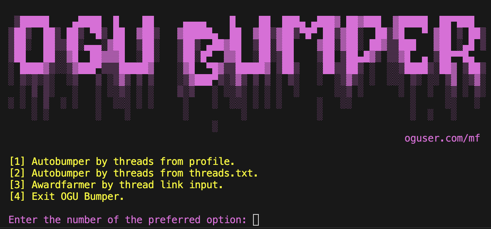

# OGU Bumper (Working  07/2024)

## Preview:



## Modes:
[1] Bumps all threads from 'Market' section on user profile with 2 hour interval.  
[2] Bumps all threads from links in threads.txt file every hour.  
[3] Spams random messages in thread by input link. Useful for farming awards during events.  

## Setup:

### Requirements
You need Python 3.10 or a newer Version to run your code.  

### Python Modules
```
pip install selenium==4.12.0
pip install seleniumbase
pip install randfacts
```

### Files
Enter your username and password in config.py.
If you want to use the Autobumper by links, put your links in threads.txt

## Usage

Make sure to install all the libraries, then go to the folder in your terminal and run:
```
python3 main.py
```

## Help

If you need any help with the script feel free to reach out.  
Discord: edlzitrone    -    Telegram: @beamertaken - OGU: mf

