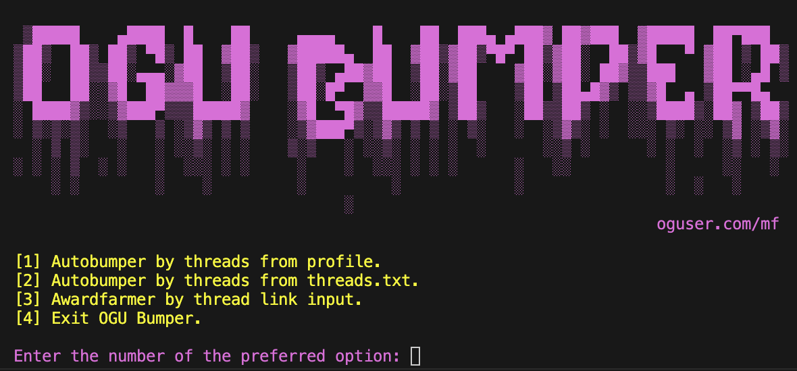

# OGU Bumper (Working  07/2026)

## Preview:



## Modes:
[1] Bumps all threads from 'Market' section on user profile with 2 hour interval.  
[2] Bumps all threads by links in threads.txt file every 2 hours.  
[3] Spams random messages in thread by input link. Useful for farming awards during events.  

## Requirements
To install and run the Autobumper you will need [Git](https://git-scm.com/downloads), [Python](https://www.python.org/downloads/) and [Google Chrome](https://www.google.com/chrome/).

## Setup:

### Unix (Linux / macOS)
```bash
git clone https://github.com/EdlZitrone/oguser-autobumper.git
cd oguser-autobumper

python3 -m venv .venv
source .venv/bin/activate

pip install -r requirements.txt
```

### Windows
```bat
git clone https://github.com/EdlZitrone/oguser-autobumper.git
cd oguser-autobumper

python -m venv .venv
.venv\Scripts\activate

pip install -r requirements.txt
```

## Usage

Enter your username and password in config.py.
If you want to use the Autobumper by links, put the urls in threads.txt

Enter 'oguser-autobumer' directory in terminal and run:

**Unix (Linux / macOS):**
```
python3 main.py
```

**Windows:**
```
python main.py
```

## Help

Please leave a star on the repository if it is useful to you.
If you need any help with the script feel free to reach out.
Discord: edlzitrone    -    Telegram: @beamertaken - OGU: mf

